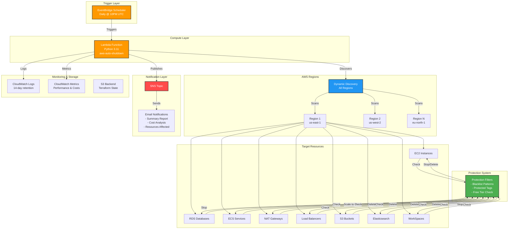
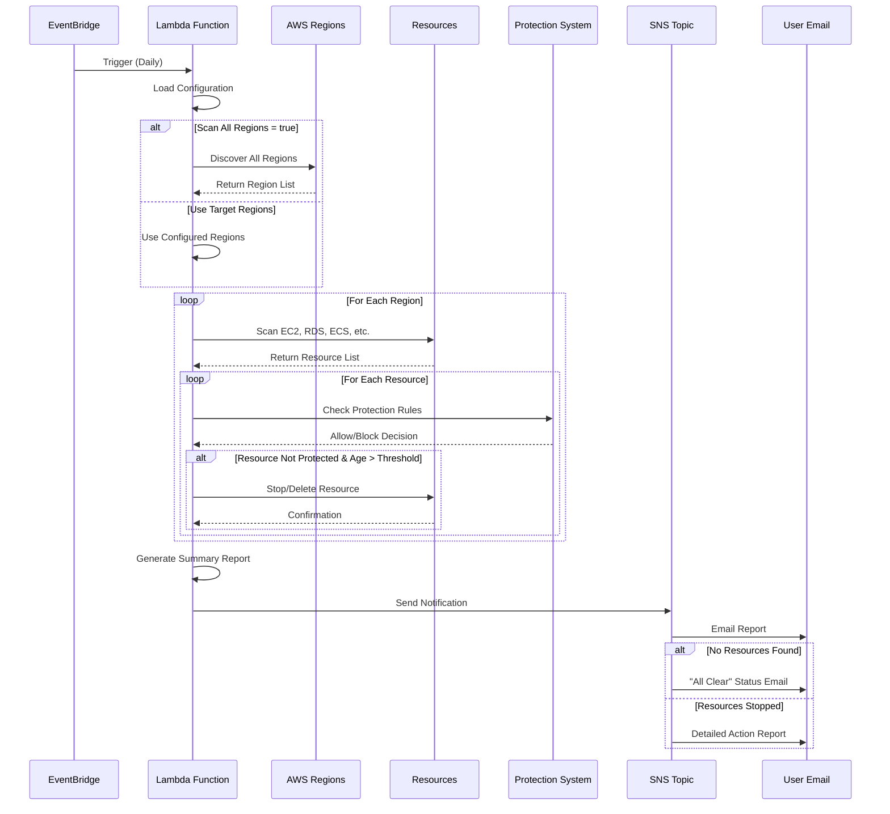

# AWS Utilities - Auto-Shutdown Service

Automated AWS resource management to prevent cost overruns. This repository contains a Terraform-deployed Lambda function that automatically shuts down AWS resources exceeding a specified age threshold.

## Overview

The AWS Auto-Shutdown service helps manage cloud costs by automatically cleaning up old, potentially forgotten resources across multiple AWS regions. It runs on a configurable schedule and sends notifications about its actions.

### Key Features

- **Automated Resource Management**: Stops/deletes resources older than configured threshold
- **Multi-Region Support**: Scans and manages resources across multiple AWS regions
- **Cost Optimization**: Intelligent scheduling with cost impact analysis
- **Protection System**: Whitelist/blacklist patterns to protect critical resources
- **Comprehensive Logging**: Structured JSON logging with CloudWatch integration
- **Flexible Notifications**: Email alerts via SNS with detailed cleanup summaries
- **Dry-Run Mode**: Test cleanup operations without actually affecting resources

### Supported Resource Types

- **EC2 Instances**: Stops instances older than threshold
- **RDS Databases**: Stops database instances  
- **ECS Services**: Scales services to 0 tasks
- **NAT Gateways**: Deletes gateways and releases Elastic IPs
- **Load Balancers**: Removes ELB/ALB/NLB load balancers
- **S3 Buckets**: Deletes buckets (with safety checks)
- **Elasticsearch/OpenSearch**: Deletes domains
- **Amazon WorkSpaces**: Stops running WorkSpaces (when enabled)

## Quick Start

### Prerequisites

1. AWS CLI configured with appropriate credentials
2. Terraform >= 1.0
3. Python 3.11+ (for local testing)
4. IAM permissions for Lambda, EventBridge, SNS, and resource management

### Installation

1. **Clone the repository**:
   ```bash
   git clone https://github.com/yourusername/aws-utils.git
   cd aws-utils/terraform
   ```

2. **Configure your settings**:
   ```bash
   cp terraform.tfvars.example terraform.tfvars
   # Edit terraform.tfvars with your email and preferences
   ```

3. **Deploy the infrastructure**:
   ```bash
   terraform init
   terraform plan
   terraform apply
   ```

4. **Confirm SNS subscription**:
   Check your email and confirm the subscription to receive notifications.

## Architecture

### Architecture Diagram



### Resource Flow Diagram



### Components

1. **Lambda Function** (`terraform/lambda_function.py`)
   - Python 3.11 runtime
   - Executes cleanup logic across regions
   - Implements cost analysis and protection checks
   - Sends SNS notifications

2. **EventBridge Scheduler**
   - Triggers Lambda on schedule (default: 10 PM UTC daily)
   - Configurable via `schedule_expression` variable

3. **SNS Topic**
   - Sends email notifications for all cleanup actions
   - Includes cost impact analysis in notifications

4. **CloudWatch**
   - Stores execution logs with configurable retention
   - Custom metrics for monitoring
   - Alarms for errors and performance issues

5. **S3 Backend**
   - Terraform state management
   - Bucket: `aws-utils-terraform-state-bucket`
   - Region: `ap-southeast-2`

## Configuration

### Required Settings

Create `terraform.tfvars` with:
```hcl
notification_email = "your-email@example.com"
```

### Key Configuration Variables

| Variable | Description | Default |
|----------|-------------|---------|
| `max_age_days` | Days before resource shutdown | 3 |
| `dry_run` | Test mode without stopping resources | "false" |
| `scan_all_regions` | Automatically scan ALL AWS regions | false |
| `target_regions` | AWS regions to scan (if scan_all_regions is false) | ["us-east-1", "us-west-2", "ap-southeast-2", "ap-southeast-4", "eu-west-1"] |
| `enable_workspaces_monitoring` | Monitor and stop Amazon WorkSpaces | false |
| `always_send_notification` | Send email even when no resources found | true |
| `schedule_expression` | CloudWatch Events schedule | "cron(0 22 * * ? *)" |
| `log_level` | Logging verbosity (minimal/verbose) | "minimal" |
| `protection_enabled` | Enable resource protection system | true |
| `cost_optimization_enabled` | Enable cost-based scheduling | true |

### Protection Configuration

Protect critical resources using patterns and tags:

```json
{
  "ec2": {
    "blacklist_patterns": ["*production*", "*critical*"],
    "protected_tags": {
      "Environment": ["production", "prod"],
      "Protected": ["true"]
    }
  }
}
```

### Cost Optimization Settings

- `cost_threshold_high`: Monthly cost to consider resource high-value ($100)
- `cost_threshold_require_approval`: Requires approval before deletion ($500)
- `business_hours_start/end`: Avoid cleanup during business hours
- `cost_optimized_cleanup_windows`: Preferred cleanup time windows

### Schedule Examples

```hcl
# Daily at 10 PM UTC
schedule_expression = "cron(0 22 * * ? *)"

# Every 12 hours
schedule_expression = "rate(12 hours)"

# Weekdays only at 6 PM UTC
schedule_expression = "cron(0 18 ? * MON-FRI *)"
```

## Deployment

### Initial Deployment

```bash
cd terraform
terraform init
terraform plan -out=tfplan
terraform apply tfplan
```

### Updating the Lambda Function

1. Edit `terraform/lambda_function.py`
2. Apply changes:
   ```bash
   terraform apply
   ```

### Updating Configuration

1. Modify `terraform.tfvars`
2. Apply changes:
   ```bash
   terraform apply
   ```

## Testing

### 1. Dry-Run Testing

Always test with dry-run mode first:
```hcl
# In terraform.tfvars
dry_run = "true"
max_age_days = 1  # Test with short threshold
```

### 2. Manual Invocation

```bash
# Invoke Lambda manually
aws lambda invoke \
  --function-name aws-auto-shutdown \
  --payload '{}' \
  response.json

# Check results
cat response.json
```

### 3. Monitor Logs

```bash
# Follow CloudWatch logs
aws logs tail /aws/lambda/aws-auto-shutdown --follow

# View recent log streams
aws logs describe-log-streams \
  --log-group-name /aws/lambda/aws-auto-shutdown \
  --order-by LastEventTime \
  --descending \
  --limit 5
```

### 4. Verify Protection

Test that protected resources are skipped:
1. Tag a test resource with `Protected=true`
2. Run Lambda in dry-run mode
3. Verify resource appears in protection logs

## Troubleshooting

### Lambda Not Executing

- **Check EventBridge rule**: 
  ```bash
  aws events describe-rule --name aws-auto-shutdown-daily
  ```
- **Verify IAM permissions**: Review Lambda execution role
- **Check CloudWatch Logs**: Look for error messages

### Not Receiving Notifications

- Confirm SNS subscription in your email
- Check spam/junk folder
- Verify email in `terraform.tfvars`
- Check SNS topic:
  ```bash
  aws sns list-subscriptions-by-topic \
    --topic-arn arn:aws:sns:region:account:aws-auto-shutdown-notifications
  ```

### Resources Not Being Stopped

- Ensure `dry_run = "false"` in configuration
- Check resource age exceeds `max_age_days`
- Verify Lambda has permissions for target regions
- Review protection configuration for exclusion patterns
- Check scheduling constraints (business hours, cost windows)

### Terraform State Issues

If you encounter state lock issues:
```bash
# Force unlock (use carefully)
terraform force-unlock <lock-id>

# Refresh state
terraform refresh
```

## Cost Estimation

### AWS Free Tier Usage

Configuration optimized for free tier:
- **Lambda**: ~$0.20/month (1 execution/day, 256MB, 5-min runtime)
- **CloudWatch Logs**: 
  - Minimal logging: ~$0-0.50/month (stays in free tier)
  - Verbose logging: ~$1-3/month (may exceed free tier)
- **SNS**: Free tier covers 1,000 email notifications/month
- **Total**: < $1/month with minimal logging

### Cost Optimization Tips

1. Use `log_level = "minimal"` to stay within free tier
2. Set CloudWatch log retention to 1 day
3. Optimize Lambda memory allocation (256MB is sufficient)
4. Use scheduling to run during off-peak hours

## Development

### Project Structure

```
aws-utils/
├── terraform/
│   ├── lambda_function.py    # Lambda function code
│   ├── main.tf               # Terraform infrastructure
│   ├── variables.tf          # Variable definitions
│   ├── outputs.tf            # Output definitions
│   └── terraform.tfvars      # Your configuration (git-ignored)
├── scripts/
│   ├── aws-shutdown-report.py    # Generate resource reports
│   └── aws-auto-shutdown.sh      # Manual shutdown script
├── CLAUDE.md                 # AI assistant context
└── README.md                 # This file
```

### Adding New Resource Types

1. Add cleanup function in `lambda_function.py`:
   ```python
   def cleanup_old_<resource_type>(region, max_age_days, dry_run=True):
       # Implementation
   ```

2. Update IAM permissions in `main.tf`

3. Add to `lambda_handler()` execution flow

4. Update SNS notification formatting

5. Test thoroughly with dry-run mode

### Manual Scripts

Generate resource reports:
```bash
python scripts/aws-shutdown-report.py \
  --max-age-days 3 \
  --output aws-resources-report.json
```

Manual shutdown with report:
```bash
./scripts/aws-auto-shutdown.sh \
  --dry-run \
  --max-age-days 3 \
  --report-file aws-resources-report.json
```

## Security Notes

- Lambda function uses minimal required IAM permissions
- S3 bucket for Lambda packages is private with public access blocked
- IAM role follows least-privilege principle
- Sensitive values handled as Terraform variables
- Protection system prevents accidental deletion of critical resources
- All actions are logged for audit purposes

## Cleanup

To remove all deployed resources:

```bash
cd terraform
terraform destroy
```

This will remove:
- Lambda function and execution role
- EventBridge schedule rule
- SNS topic and subscriptions
- CloudWatch log groups and alarms
- S3 bucket for Lambda deployments

## Contributing

1. Fork the repository
2. Create a feature branch
3. Test changes thoroughly with dry-run mode
4. Submit a pull request with detailed description

## License

MIT License - See LICENSE file for details

## Support

For issues, questions, or suggestions:
- Open an issue on GitHub
- Check existing issues for solutions
- Review CloudWatch logs for debugging